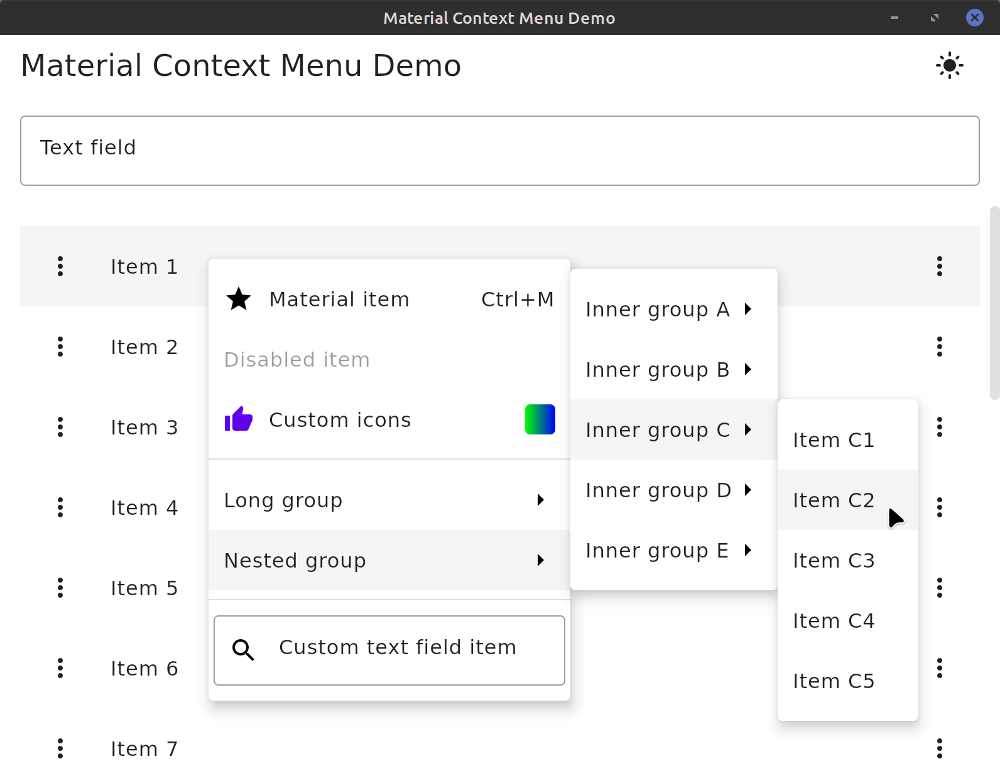
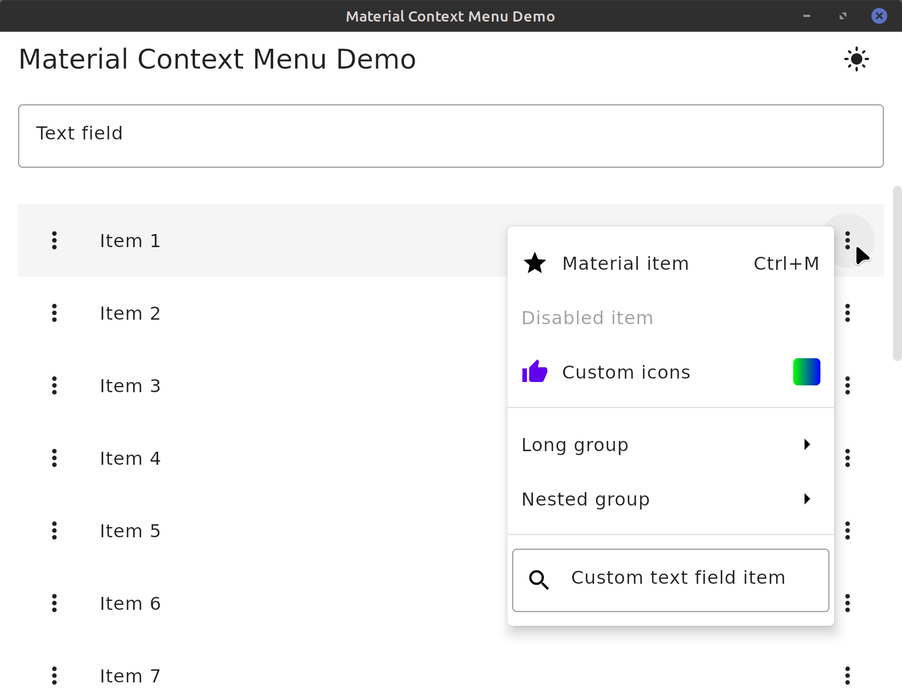
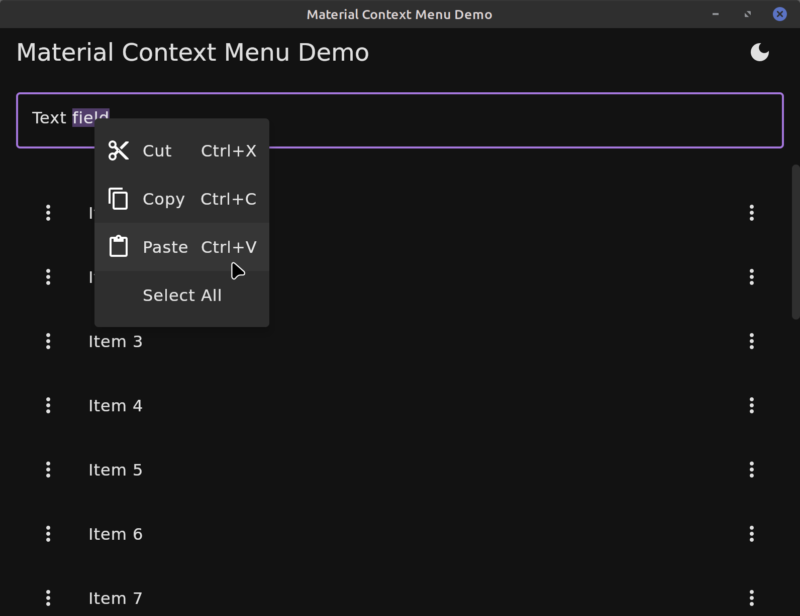

# Compose Material Context Menus

[](https://github.com/dzirbel/compose-material-context-menu/actions/workflows/build.yml)
[](https://search.maven.org/artifact/io.github.dzirbel/compose-material-context-menu)

Implementation of context (right-click) menus
for [Compose Mutliplatform](https://github.com/JetBrains/compose-multiplatform).

|  |  |
|-----------------------------------|-----------------------------------|
|  |  |

### Features

This library is built on top of Compose
Multiplatform's [context menu API](https://github.com/JetBrains/compose-multiplatform/blob/master/tutorials/Context_Menu/README.md)
as an alternate `ContextMenuRepresentation`. In addition to Compose's functionality, this library
adds:

- Customizable theming, by default compliant with Material
  2/3 [menus](https://m3.material.io/components/menus/specs)
- Material menu items with icons, enabled/disabled states, and keyboard shortcuts
- Dividers
- Nested sub-menus (see [known issues](#known-issues))
- Custom `@Composable` item content
- Scroll bars when menu is larger than the window
- Context menus in overflow (triple-dot) buttons

This repository includes a simple demo application to play with the library. Run
with `./gradlew :demo:run`.

### Known issues

- **Important**: Menus are immediately closed if a menu group item is clicked. I don't recommend 
  using groups until this issue is fixed.
- Dropdown height extends slightly beyond the window size if the menu is larger than the window.

### Usage

Add the dependency to your project (ensuring that the `mavenCentral()` repository is included):

```kotlin
implementation("io.github.dzirbel:compose-material-context-menu:0.1.0")
```

See the [:demo](/demo/src/main/kotlin/com/dzirbel/contextmenu) project in this repository for usage examples.

#### Application

Supply a `MaterialContextMenuRepresentation` as the `LocalContextMenuRepresentation` at the root of
your application's composition:

```kotlin
// apply the MaterialTheme first to use its colors in the MaterialContextMenuRepresentation
MaterialTheme(colors = colors) {
    CompositionLocalProvider(
        LocalContextMenuRepresentation provides MaterialContextMenuRepresentation(),
        // optional: use Material text field context menu items, with icons and keyboard shortcuts
        LocalTextContextMenu provides MaterialTextContextMenu,
    ) {
        // application content
    }
}
```

Styling (dimensions, colors, etc) of the menus can be customized by providing `measurements`,
`colors`, etc to `MaterialContextMenuRepresentation()`.

Context menus are created as in the
[context menu API](https://github.com/JetBrains/compose-multiplatform/blob/master/tutorials/Context_Menu/README.md),
i.e. with a `ContextMenuArea()` wrapping the right-clickable content.

#### Item types

In addition to the standard `ContextMenuItem`, this library adds:

- `MaterialContextMenuItem`: an augmented menu item with optional `enabled` state
  and `leadingIcon`/`trailingIcon`
    - Icons are provided in the `ContextMenuIcon` interface, and support icons from `Painter`,
      resource path, `ImageVector`, or `ImageBitmap`
    - Icons may also be any generic `@Composable` content or a list of `ContextMenuShortcut`s
      representing keyboard shortcuts
- `ContextMenuGroup`: a group of menu items, displayed as a nested menu on hover
- `ContextMenuDivider`: a divider line between items
- `CustomContentContextMenuItem`: a menu item with custom `@Composable` content, with standard
  styling (clickable, etc) applied
- `GenericContextMenuItem`: a menu item with custom `@Composable` content and no standard styling
  applied

#### Overflow button

To show context menus with a left-click on an overflow button, this library also provides a
standalone `ContextMenuOverflowButton()` composable.
